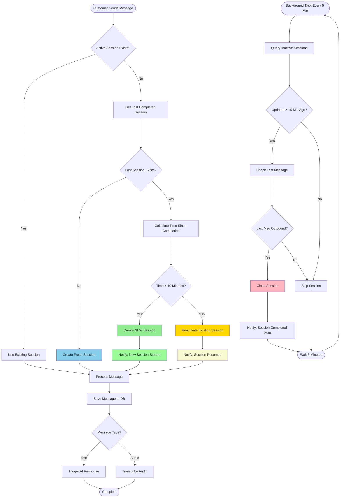

# Session Expiry System - Flow Diagram

## Legend

- **Green**: New session creation after expiry
- **Yellow**: Session reactivation within window
- **Blue**: Fresh session creation (first time)
- **Pink**: Background auto-closure
- **Light Green**: Notification for new session
- **Light Yellow**: Notification for resumed session

## Two Parallel Processes

### 1. Message Handling (Top Flow)

Triggered when customer sends a message. Decides whether to:

- Use existing active session
- Create new session (if >10 mins expired)
- Reactivate recent session (if <10 mins)
- Create fresh session (first time customer)

### 2. Background Cleanup (Bottom Flow)

Runs every 5 minutes automatically. Closes sessions that:

- Haven't been updated in >10 minutes
- Last message was from bot/agent (outbound)
- Are in active/waiting/escalated status

## Key Decision Points

### Time-Based Decision

```
Time Since Last Activity:
├─ < 10 minutes → Reactivate existing session
└─ > 10 minutes → Create new session
```

### Message Direction Check

```
Last Message Direction:
├─ Outbound (from bot/agent) → Safe to close
└─ Inbound (from customer) → Keep open (waiting for response)
```

## Example Timeline

```
10:00 AM │ Customer: "Hello"
10:01 AM │ Bot: "How can I help?"
10:02 AM │ Customer: "Thanks"
10:03 AM │ Bot: "Goodbye!"
         │
10:08 AM │ [Background Task Runs]
         │ ├─ Session updated 5 mins ago
         │ └─ Skip (not yet 10 mins)
         │
10:13 AM │ [Background Task Runs]
         │ ├─ Session updated 10 mins ago
         │ ├─ Last message: Outbound
         │ └─ ✓ Close Session
         │
10:20 AM │ Customer: "New question"
         │ ├─ No active session
         │ ├─ Last session completed 17 mins ago
         │ └─ ✓ Create NEW Session
```

## Security Considerations

### Session Boundary Enforcement

- Each expired session gets a NEW session ID
- Prevents session fixation attacks
- Maintains clear audit trail

### Timezone Safety

- All times in UTC
- Timezone-aware comparisons
- Handles DST transitions

### Data Isolation

- New sessions don't inherit old session data
- Each session has independent context
- No cross-session contamination
